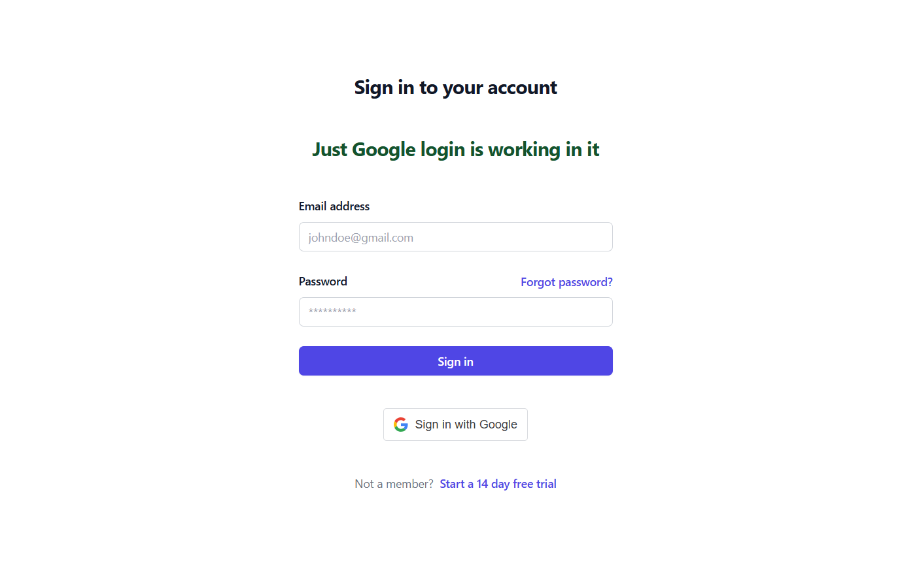
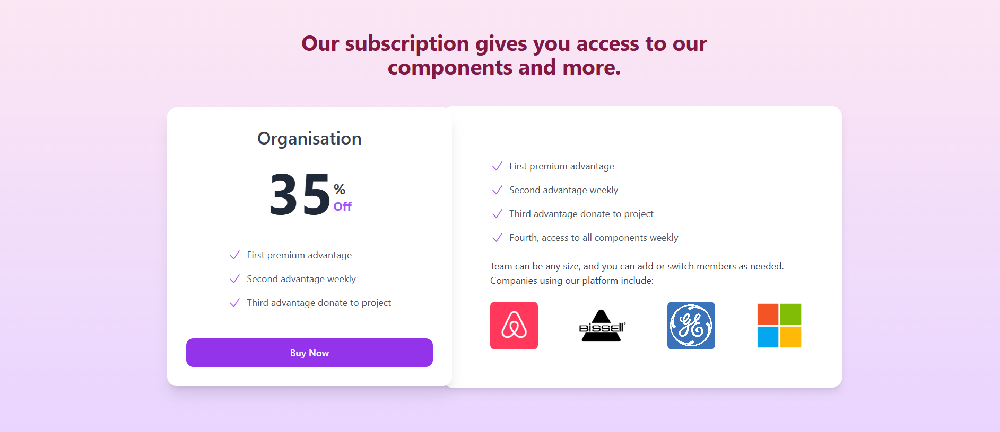

# 🔐 Stripe-Protected App with Google Login (Django + React)

A full-stack authentication and payment system built with **Django** and **React (Vite)**. Users must log in via **Google OAuth2**, then complete a **Stripe Checkout payment** to gain access to the protected dashboard. Stripe webhooks are used to confirm payment status.

---

## 🚀 Features

- ✅ Google OAuth 2.0 Login
- 💳 Stripe Checkout integration
- 📬 Stripe Webhook listener (Django)
- 🔐 Protected routes only for paid users
- ⚛️ Frontend built with React + Vite
- 🧠 Backend powered by Django REST API

---

## 🗂️ Folder Structure

google-stripe-auth/ │ ├── backend/ # Django backend │ ├── manage.py │ ├── main/ # Django settings, URLs, views │ ├── users/ # Handles login, token verification │ └── payments/ # Stripe checkout, webhook logic │ ├── frontend/ # React frontend │ ├── src/ │ └── package.json │ └── README.md


---

## 🛠️ Local Setup

### 1️⃣ Backend (Django)

```bash
cd backend
python -m venv venv
venv\Scripts\activate  # or source venv/bin/activate on Mac/Linux
pip install -r requirements.txt
cp .env.example .env   # Create and configure environment variables

python manage.py migrate
python manage.py runserver
```bash
Example .env (Django)
```bash
DEBUG=True
STAGE=development

DATABASE_ENGINE=django.db.backends.mysql
DATABASE_NAME=luis_pro_db
DATABASE_USER=root
DATABASE_PASSWORD=
DATABASE_HOST=localhost
DATABASE_PORT=3306

FRONTEND_URL=http://localhost:5173

GOOGLE_OAUTH2_CLIENT_ID=85469282921-b2jjaeb1gfaovuhu38ipt5561s4v1r94.apps.googleusercontent.com
GOOGLE_OAUTH2_CLIENT_SECRET=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

STRIPE_SECRET_KEY=sk_test_...
STRIPE_PUBLIC_KEY=pk_test_...
STRIPE_WEBHOOK_SECRET=whsec_...

ALLOWED_HOSTS=*,localhost
CSRF_TRUSTED_ORIGINS=http://127.0.0.1
SECRET_KEY=#your_secret_key
ENCRYPTION_KEY=your_32byte_key_base64
```bash


2️⃣ Frontend (React + Vite)
```bash
cd frontend
npm install
cp .env.example .env  # Set your environment variables
```bash
Example .env (React)
```bash
VITE_GOOGLE_CLIENT_ID=85469282921-b2jjaeb1gfaovuhu38ipt5561s4v1r94.apps.googleusercontent.com
GOOGLE_SECRET_ID=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

VITE_STRIPE_SECRET=sk_test_...
VITE_STRIPE_PUBLIC=pk_test_...

VITE_BACKEND_URL=http://127.0.0.1:8000/api
npm run dev
```bash

⚙️ Flow Overview
1 User signs in with Google (React + OAuth)

2 App checks backend if payment is completed

3 If not, redirects to Stripe Checkout

4 Stripe webhook (via CLI) updates user access in DB

5 User gains access to protected dashboard


🧪 Webhook Testing with Stripe CLI
```bash
Use Stripe CLI to forward webhook events during development:
stripe listen --forward-to localhost:8000/backend/webhook/
Copy the secret from the CLI output:
> Ready! Your webhook signing secret is whsec_...
Paste this into your .env file:
STRIPE_WEBHOOK_SECRET=whsec_...
stripe trigger checkout.session.completed
```bash




After successfull payent you will be able to see services page